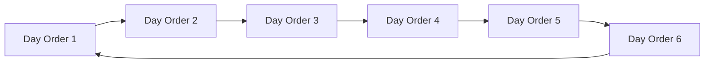

# FAFLOW — Academic Management & Day Order Engine

This document details the Academic Calendar, Semester definitions, and the cyclical Day Order scheduling engine.

---

## 1. Academic Calendar Single Source of Truth

In FAFLOW, the `calendar_days` table is the **single source of truth** for institutional date validity:

| Day Type (`day_type`) | Scheduling Meaning | Day Order (`day_order`) | Leave / Credit Impact |
|---|---|---|---|
| `working` | Active instructional day | Integer `1` to `6` | Classes held; leaves require substitution and deduct credits. |
| `holiday` | Official institution holiday | `NULL` | No classes held; no leaves permitted; zero credit impact. |
| `exam` | Scheduled examination day | `NULL` or Assigned | Classes paused for exams; operational staff may receive duty credits. |
| `vacation` | Academic term break | `NULL` | Inactive teaching period. |

---

## 2. Cyclical Day Order Rotation (1–6)

Instead of relying on fixed calendar weekdays (Monday–Friday), FAFLOW uses a rotational **Day Order (1 through 6)** schedule model:

### Holiday Pause Invariant
When a holiday occurs on a weekday (e.g., Wednesday is declared a holiday after Tuesday's Day Order 2), the Day Order sequence **pauses**. Thursday automatically resumes on **Day Order 3**. This ensures that curriculum hours remain perfectly balanced across all courses without needing timetable edits.
