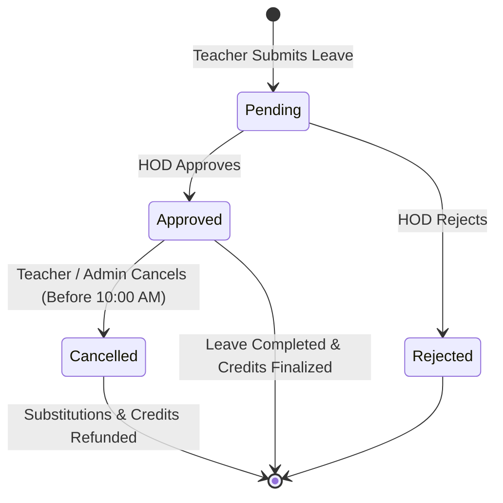

# FAFLOW — Leave Management & Approval Workflows

This document outlines leave policies, validation rules, approval pipelines, and cancellation semantics for both Academic Faculty and Operational Personnel.

---

## 1. Academic Faculty Leave Architecture

### Leave Submission & Validation:
- Teachers can apply for Full Day leaves or select specific teaching periods.
- Submissions on non-working calendar days or holidays are rejected immediately by the backend validator.
- If a teacher has existing classes on the requested date, the affected timetable slots are identified for substitute allocation.

### Workflow & Invariants:

---

## 2. Operational Staff Leave Architecture

- Laboratory Staff and Non-Teaching Staff submit leave requests with session designations (*Full Day*, *Forenoon FN*, *Afternoon AN*).
- Operational leaves are reviewed and authorized by the **Operational Manager**.
- Approval automatically posts a deduction to the staff member's live credit balance in `staff_credits`.
