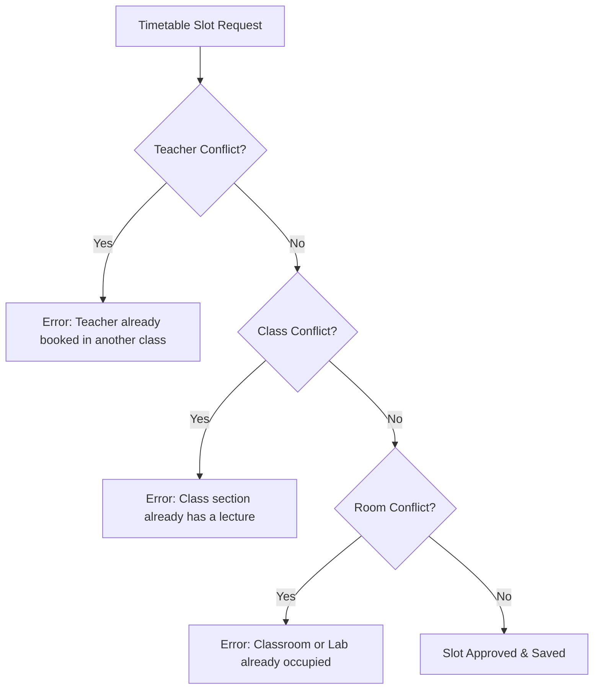

# FAFLOW — Timetable Management & Conflict Engine

This document details schedule creation, multi-dimensional conflict detection, bulk CSV uploads, and timetable approval workflows.

---

## 1. Five-Period Timetable Grid

FAFLOW standardizes on exactly **5 instructional periods per working day**:

| Period | Standard Time Window | Description |
|---|---|---|
| **Period 1** | `08:00 – 09:00` | Morning Lecture / Session 1 |
| **Period 2** | `09:00 – 10:00` | Morning Lecture / Session 2 |
| **Break** | `10:00 – 10:15` | Mid-Morning Recess |
| **Period 3** | `10:15 – 11:15` | Midday Lecture / Session 3 |
| **Period 4** | `11:15 – 12:15` | Midday Lecture / Session 4 |
| **Lunch** | `12:15 – 01:00` | Lunch Recess |
| **Period 5** | `01:00 – 02:00` | Afternoon Practical / Lecture / Session 5 |

---

## 2. Hard Conflict Detection Invariants

Every timetable allocation (`Day Order`, `Period Number`) must satisfy three strict unique constraints:

1. **Teacher Conflict**: A faculty member cannot be scheduled to teach two different classes in the same period on the same Day Order.
2. **Class Section Conflict**: A class section cannot have more than one course scheduled in the same period.
3. **Room / Lab Conflict**: A physical classroom or laboratory cannot accommodate multiple simultaneous sessions.
