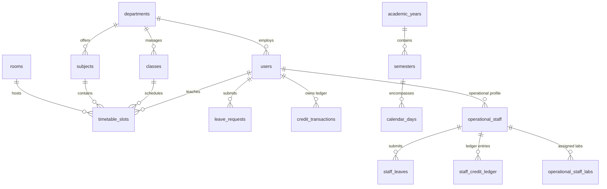

# FAFLOW — Database Architecture & Migrations

This document details the relational schema, integrity constraints, triggers, and migration history of the FAFLOW PostgreSQL database.

---

## 1. Entity-Relationship Diagram (Core Domains)

---

## 2. Table Catalog & Invariants

### A. Academic & User Domain
- `users`: User identity, authentication hash, role (`admin`, `principal`, `manager`, `teacher`, `lab_staff`, `non_teaching_staff`), `admin_level`, `department_id`, and `must_change_credentials` gate.
- `departments`: Department code, name, and active autonomous substitution mode.
- `classes`: Academic year/semester class section (e.g. *CSE 3rd Year Section A*).
- `subjects`: Course catalog code, credit hours, and department link.
- `rooms`: Physical lecture halls and laboratories with capacity attributes.

### B. Scheduling Domain
- `academic_years` & `semesters`: Date-bound institutional terms.
- `calendar_days`: Single source of truth for working days and Day Orders (`1` to `6`).
- `timetable_slots`: 5-period schedule slots with triple unique constraints.

### C. Substitution & Credit Domain
- `leave_requests`: Faculty leave requests, session flags, and approval status.
- `alter_assignments`: Substitute teacher assignments and emergency flags.
- `teacher_credits`: Cached O(1) balance for academic teachers.
- `credit_transactions`: Append-only audit ledger recording every credit delta.

### D. Operational Staff Domain
- `operational_staff`: Extended profile for laboratory and non-teaching personnel.
- `operational_staff_labs`: Mapping of lab staff to physical laboratory rooms.
- `staff_leaves`: Operational staff leave requests and manager approval states.
- `staff_credits`: Annual leave quotas and live credit balances for operational staff.
- `staff_credit_ledger`: Running double-entry ledger for operational personnel.

---

## 3. Migration History Catalog

| Migration | File | Description |
|---|---|---|
| **001** | `schema.sql` | Baseline v1 schema (users, classes, subjects, rooms, slots, credits). |
| **002** | `migrations/002_add_rbac_and_audit.sql` | Introduces RBAC levels, `audit_logs`, and first-login credential reset gates. |
| **003** | `migrations/003_academic_calendar.sql` | Introduces `academic_years`, `semesters`, `calendar_days`, and 5-period constraint. |
| **004** | `migrations/004_autonomous_substitution.sql` | Introduces engine scoring preferences, locks, and fairness metrics. |
| **005** | `migrations/005_add_cancelled_leave_status.sql` | Adds `cancelled` leave state and credit refund support. |
| **006** | `migrations/006_multi_department.sql` | Adds multi-department tenant isolation and cross-department permissions. |
| **007** | `migrations/007_performance_indexes.sql` | Composite B-tree indexes for high-frequency schedule and leave queries. |
| **008** | `migrations/008_add_manager_and_staff.sql` | Adds `manager` role, operational staff tables, and staff credit ledgers. |
