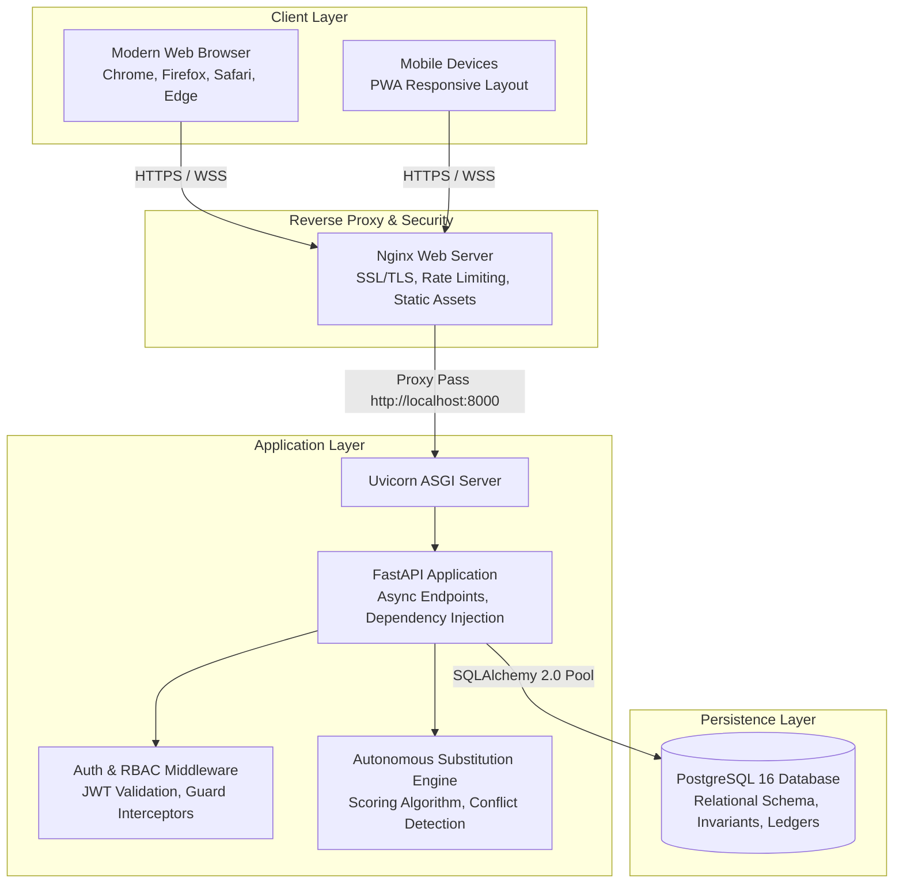

# FAFLOW — System Architecture Overview

This document presents the high-level system context, component topology, and data flows of the FAFLOW enterprise platform.

---

## 1. High-Level Component Topology

---

## 2. Key Architectural Tenets

1. **Database as the Invariant Enforcer**:
   - PostgreSQL constraints (`CHECK`, `UNIQUE`, `FOREIGN KEY`) enforce domain rules at the physical data layer (e.g. max 5 periods/day, no double-bookings, strict 1–6 Day Orders).
2. **Stateless API Services**:
   - Backend instances store no session state; authentication relies on signed HMAC-SHA256 JWT tokens with database-backed revocations.
3. **Dual Ledger Architecture**:
   - Academic Workload Credits and Operational Staff Leave Days operate on independent, immutable double-entry ledgers.
4. **Single Source of Calendar Truth**:
   - Date validity is governed solely by `calendar_days`, ensuring consistent behavior across scheduling, leave accounting, and reporting modules.
