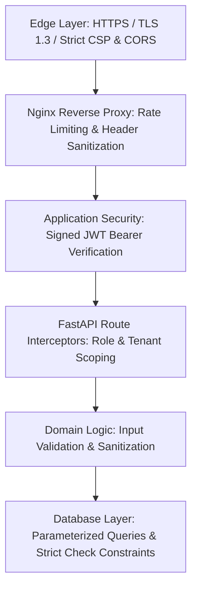

# FAFLOW — Enterprise Security & Threat Model

This document outlines the defense-in-depth security model, threat vector mitigations, and cryptographic standards of FAFLOW.

---

## 1. Defense-in-Depth Security Architecture

---

## 2. Cryptographic Protocols & Storage

- **Password Hashing**: Cryptographic `bcrypt` algorithm with automated salting and work factor `12`. Plaintext passwords are never logged, cached, or persisted.
- **Session Tokens**: Compact JSON Web Tokens (JWT) signed with HMAC-SHA256 (`HS256`).
- **Transport Encryption**: Enforced TLS 1.2 / 1.3 for all web client and API traffic.
- **SQL Injection Prevention**: 100% of database interactions execute through SQLAlchemy parameter binding, preventing SQL injection vulnerabilities.
